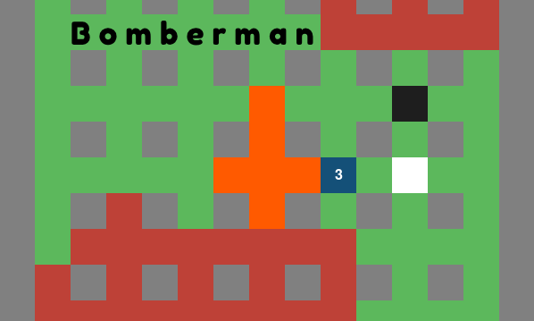

<div align="center">
  
<h3>Bomberman</h3>
<p max-width=30ch>Tic... Tac... BOOM ! Explode everything !</p>
</div>

## 📋 Table des matières
1. [Introduction](#introduction)
2. [Technologie](#technologie)
3. [Fonctionnalities](#fonctionnalité)
4. [Quick Start](#essaie)
5. [Droits](#droits)
   
## <a name="introduction">🤖 Introduction<a/> 
This project is a custom implementation of AI agents for a Bomberman-style game, designed to simulate various difficulty levels through distinct behavioral strategies.<br> 
The game features destructible terrain, shrinking borders, bomb-based combat, and pathfinding challenges — making it an ideal environment for developing and testing game AI logic.


## <a name="technologie">⚙️ Technologie<a/> 
- Python

## <a name="fonctionnalité">🔋 Fonctionnalities<a/> 
**Difficulty Levels:**<br>
🟢 Easy AI:
  - Friendly explorer.

  - Destroys nearby obstacles.

  - Basic bomb avoidance for survival.

🟡 Medium AI:
  - Moderate follower.

  - Destroys obstacles blocking access to the player.

  - Basic danger awareness without advanced tactics.

🔴 Hard AI:
  - Dangerous hunter.
  
  - Prioritizes center control or tactical areas.

  - Strategically places bombs with escape routes.
    
**Tournament AI against AI:**<br>
  - All difficulty level.
  - Score Tracker.
  - Game data and analyze.

## <a name="essaie">🤸 Quick Start<a/> 
**Prerequisites**<br>
Make sure you have the following installed on your machine:
- [Git](https://git-scm.com/)
- [Python](https://www.python.org/)

**Clone the Repository**<br>
```bash
git clone https://github.com/Rolandchn/Bomberman.git
cd Bomberman
```

**Installation**<br>
Install the project dependencies using pip:
```bash
pip install pygame
```

**Running the Project**<br>
```bash
python3 main.py
```

## <a name="droits">Authors<a/> 
The main contributors: Roland CHEN, Abdel Malik DJAFFER
